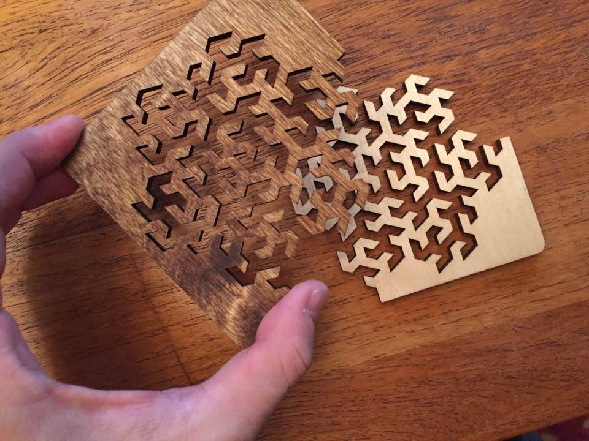
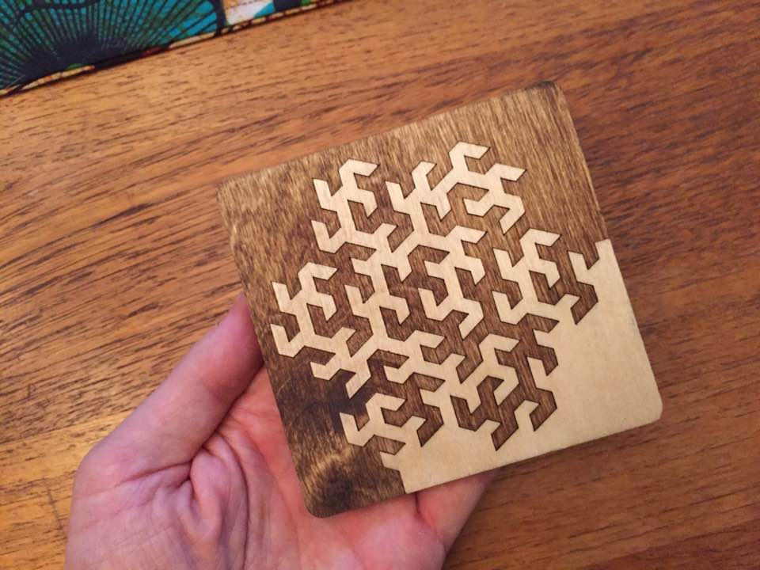

# Algorithmic Beer Coasters

This is a collection of Python scripts that generate a variety of fractal
designs for laser-cut beverage coasters. Each design is based on a different
[space-filling curve](https://en.wikipedia.org/wiki/Space-filling_curve),
evaluated using a [Lindenmayer system](https://en.wikipedia.org/wiki/L-system).

## Dependencies

These scripts have only two dependencies:
[Shapely](https://pypi.python.org/pypi/Shapely) and
[Numpy](https://pypi.python.org/pypi/numpy).

## Manufacturing Hints

I have tested this design in both birch and acrylic on a [ULS VLS 4.60](https://www.ulsinc.com/products/platforms/vls4-60), the laser system available at [TechShop](http://www.techshop.ws). To prepare the files for printing on this machine, open them in Adobe Illustrator or similar vector graphics editor and change the stroke widths to 0.001 and the stroke opacity to 1.0.

---

This work is licensed under a [Creative Commons Attribution-ShareAlike 4.0 International License](http://creativecommons.org/licenses/by-sa/4.0/).

